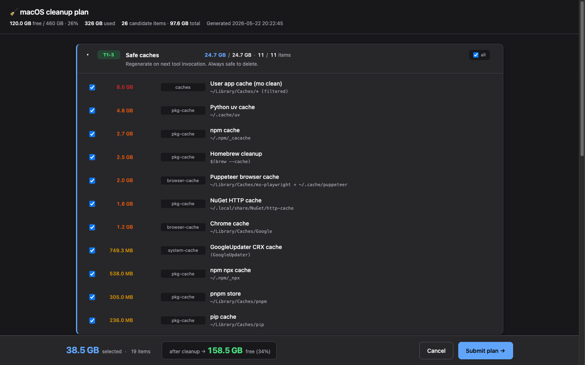
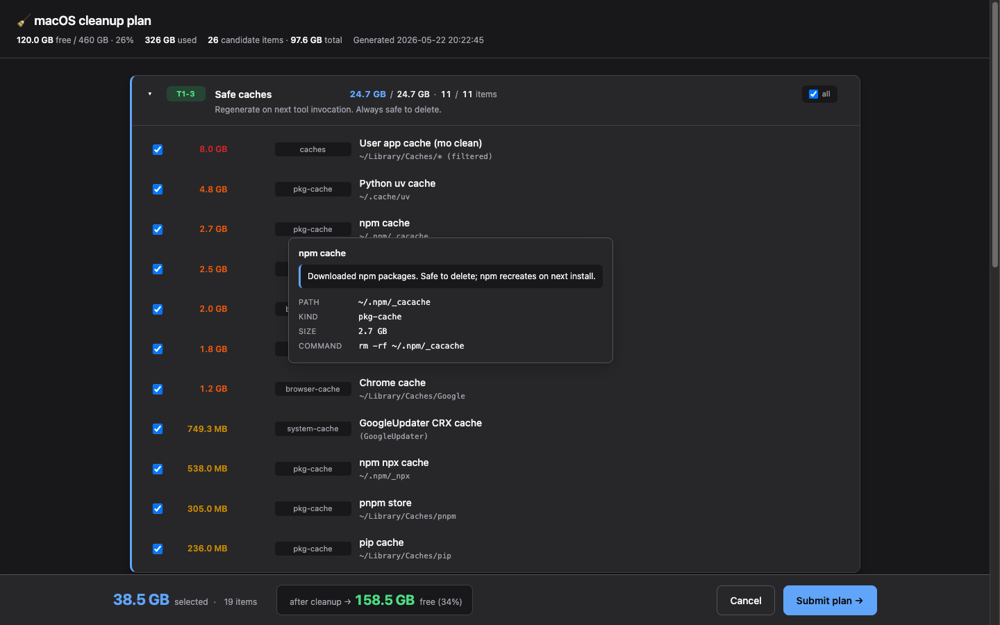

# maintaining-macos-health

> **v1.0.0** — Recovery and prevention playbook for macOS disk and memory crises, with an **interactive HTML cleanup UI**, a noise-resistant LaunchAgent alerter, and Mole-grounded safety guards. Built for Apple Silicon dev machines that run heavy workloads — Docker, multiple AI tools, IDEs, browsers.



## Table of contents

- [Why this skill](#why-this-skill)
- [Install](#install)
- [Prerequisites](#prerequisites)
- [Quick start](#quick-start)
- [What it does](#what-it-does)
  - [Triage flow (signal classification)](#triage-flow-signal-classification)
  - [Interactive cleanup UI](#interactive-cleanup-ui)
  - [Cleanup tiers (10 levels, risk-ordered)](#cleanup-tiers-10-levels-risk-ordered)
  - [Active alerter (3 CRITICAL-only triggers)](#active-alerter-3-critical-only-triggers)
- [Key features](#key-features)
- [Sources and methodology](#sources-and-methodology)
- [File structure](#file-structure)
- [License](#license)

## Why this skill

Modern macOS dev machines hit a specific failure mode that's not covered well anywhere else: a **watchdog-timeout kernel panic** caused by `vm_compressor` segments saturating to 100 % while the disk is too full to extend swap. The symptom is "Mac freezes for ~90 seconds, then reboots." The signal that always precedes it is `JetsamEvent` files containing `vm-compressor-space-shortage` — Apple's kernel killing processes for memory minutes before it gives up.

This skill packages **three complementary capabilities** for that failure mode:

1. A **triage playbook** with a first-five-minutes decision tree and a 10-tier cleanup catalogue.
2. An **interactive HTML cleanup UI** the agent renders after scanning, so the user picks exactly what gets deleted instead of trusting the agent's memory.
3. An **active LaunchAgent alerter** with three CRITICAL-only triggers, hysteresis, cooldown, and a 7-day calibration window so it doesn't cry wolf.

Validated against a real watchdog-timeout panic on Apple Silicon caused by `vm_compressor` segments saturated at 100 % with the disk over 90 % full. The same playbook works for routine cleanup or first-time setup on a new machine.

## Install

```bash
npx skills add CodeAlive-AI/ai-driven-development@maintaining-macos-health -g -y
```

## Prerequisites

| Tool | Why | Install |
|---|---|---|
| [Mole](https://github.com/tw93/mole) (`mo`) | Safety floor for cleanup — marker-based project artifact detection (`mo purge`), system cache cleanup (`mo clean`), thorough app uninstall (`mo uninstall`) | `brew install mole` |
| [alerter](https://github.com/vjeantet/alerter) | macOS notifications from launchd (replaces dead `terminal-notifier`) | `brew install vjeantet/tap/alerter` |
| Python 3 (Apple-shipped) | Powers the cleanup UI server and the apply helper. stdlib only — no pip install required | (preinstalled) |
| [Stats](https://github.com/exelban/stats) (recommended) | Passive menubar monitoring (memory pressure, disk, swap) | `brew install --cask stats` |

Apple Silicon Mac running macOS Sequoia (15.x) or Tahoe (26.x) recommended. Bash 3.2 (Apple-shipped) is the minimum — no Homebrew bash required.

## Quick start

The skill is consulted by an agent when the user reports macOS health trouble. The agent reads `SKILL.md` and runs one of these workflows:

```text
# Free space NOW (incident response)
"My Mac is full" / "out of disk space" / kernel panic happened
  → agent: triage → scan everything → resolve unknown items (web-search if needed)
         → build cleanup-data.json → render UI in browser
         → user picks via HTML checkboxes → submit
         → agent shows selection in chat → user confirms "go"
         → apply-cleanup-selection.py executes only what was picked
         → df checkpoint

# Set up alerting on a new machine
"set up disk alert" / "monitor memory pressure" / restoring after macOS reinstall
  → agent reads alerting.md, copies assets/ to ~/bin and ~/Library/LaunchAgents

# Audit storage
"what's eating my disk?" / "audit storage"
  → agent runs Mole's `mo analyze`, then suggests targeted tier from cleanup-tiers.md
```

Manual install of the alerter (without an agent):

```bash
SKILL=$HOME/.claude/skills/maintaining-macos-health
mkdir -p ~/bin ~/.config/mac-health ~/Library/Logs/mac-health ~/.local/state/mac-health
cp "$SKILL/assets/mac-health-check"          ~/bin/
cp "$SKILL/assets/config.sh"                 ~/.config/mac-health/
sed "s|__HOME__|$HOME|g" "$SKILL/assets/com.local.mac-health-check.plist" \
  > ~/Library/LaunchAgents/com.local.mac-health-check.plist
chmod +x ~/bin/mac-health-check
launchctl load -w ~/Library/LaunchAgents/com.local.mac-health-check.plist
```

Manual run of the cleanup UI (without an agent):

```bash
# 1. Build a data JSON yourself (see assets/render-cleanup-plan.py docstring for schema)
# 2. Start the UI server:
python3 ~/.claude/skills/maintaining-macos-health/assets/render-cleanup-plan.py /tmp/cleanup-data.json
# 3. Browser opens to http://127.0.0.1:18347/. Tick checkboxes. Click Submit.
# 4. Apply the selection (with --dry-run first):
python3 ~/.claude/skills/maintaining-macos-health/assets/apply-cleanup-selection.py \
  /tmp/cleanup-selection-<ts>.json --dry-run
python3 ~/.claude/skills/maintaining-macos-health/assets/apply-cleanup-selection.py \
  /tmp/cleanup-selection-<ts>.json
```

## What it does

The skill packages three complementary capabilities, each with its own entry point and assets:

| Capability | Entry point | Use |
|---|---|---|
| **Triage + cleanup playbook** | `references/triage.md`, `references/cleanup-tiers.md`, `references/never-touch.md`, `references/mole-techniques.md` | Tells the agent how to classify a health signal, which 10-tier cleanup block to run, and what categories to never touch |
| **Interactive cleanup UI** | `assets/render-cleanup-plan.py` + `assets/apply-cleanup-selection.py` | Renders a categorised, sortable, checkbox-driven HTML report from the agent's scan, serves it on `127.0.0.1:18347`, captures the user's selection, and feeds it to a sanctioned apply script that only deletes what was actually picked |
| **Active alerter** | `references/alerting.md` + `assets/{mac-health-check, config.sh, com.local.mac-health-check.plist}` | Bash + launchd implementation. 3 CRITICAL-only triggers with hysteresis, cooldown, calibration window |

### Triage flow (signal classification)

Read `references/triage.md`. First-five-minutes decision tree:

- **Disk-driven** (most common): `df` < 20 % free → run cleanup tiers
- **Memory-driven**: `memory_pressure` ≠ Normal + sustained swap → check Docker memory limit
- **Kernel-panic / watchdog-timeout**: parse panic file, identify top-RSS process, install alerter
- **JetsamEvent with `vm-compressor-space-shortage`**: imminent panic — close apps, do not run heavy cleanup
- **Thermal**: powermetrics, let it cool

### Interactive cleanup UI

The agent never decides what to delete on its own. After scanning, it builds a JSON of candidates and hands the decision to the user through a local HTML UI.



Key properties:

- **Local-only HTTP server** at `127.0.0.1:18347`, Python stdlib (`ThreadingHTTPServer`), no dependencies, no network calls.
- **Categorised cards** with colour-coded tier badges (🟢 safe, 🔵 medium, 🟠 careful, 🔴 protected).
- **Sorted by size** within each category (largest first).
- **Live counters** per category and a sticky footer with `selected GB / total GB` and an **"after cleanup → X GB free (Y %)"** preview.
- **Custom tooltips** on every row: russian/localised `description` of what the item is, full path, kind, size, age, command, and any warning.
- **Hard-protected items** appear dimmed with a 🔒 badge and require a per-item confirm dialog before they can be checked.
- **Single source of truth**: submit writes `/tmp/cleanup-selection-<ts>.json` and exits. The apply script reads only that file. **Drift protection** is structural — items the user unchecked are physically absent from the JSON and cannot be deleted, even if the agent "remembered" the default-selected list.
- **Esc** = Cancel, `prefers-reduced-motion` respected.

### Cleanup tiers (10 levels, risk-ordered)

Read `references/cleanup-tiers.md`. Each tier ends with a `df` checkpoint so the agent knows when to stop:

1. **Trivial wins** (~25 GB) — Aerial wallpapers, Trash, Warp updates, orphan app data, hang traces, cached extension VSIXs
2. **Package manager caches** (~10 GB) — npm `_npx`, Playwright, Puppeteer, NuGet, Gradle, Cargo, brew cleanup
3. **Electron caches** (~4 GB) — Slack, Notion, Arc, Cursor, etc. (Quit apps first)
4. **Stale IDE versions** (~10 GB) — JetBrains old major.minor data dirs
5. **`~/Downloads`** (~15-20 GB, interactive) — installers, recordings, archived repos
6. **System logs + vendor depots** (sudo, ~5-8 GB) — `/private/var/db/diagnostics`, Logitech depots
7. **`mo purge`** (~30-50 GB) — project artifacts via Mole's marker-based detection
8. **Docker** (~10-40 GB) — unused images, dead builders, orphan volumes (`buildx_buildkit_*_state` is often huge)
9. **Dev artifacts** (~5 GB, manual) — venvs, node_modules in inactive projects
10. **Discuss-first** — Maven repo, Rust nightly, dotTrace workspaces, `~/.AzureToolsForIntelliJ`, Claude Cowork VM, etc.

### Active alerter (3 CRITICAL-only triggers)

Read `references/alerting.md`. Runs every 5 min via `StartCalendarInterval`. Triggers:

1. **Disk free < 10 %** for 3 consecutive readings (15 min sustained)
2. **Memory pressure Critical AND swap > 8 GB** for 3 consecutive readings
3. **New `JetsamEvent-*.ips` containing `vm-compressor-space-shortage`** (immediate, no hysteresis — this is the early-warning signal)

Plus: 30-min cooldown between repeats, 7-day calibration window (logs only, no notifications), `~/.config/mac-health/silent` flag for manual suppression during heavy work, optional `ntfy.sh` URL for phone push.

## Key features

- **Drift protection (apply-cleanup-selection.py)** — the apply phase reads only `selected_items` from the selection JSON. The skill's safety rules **forbid hand-rolled `rm` blocks** at apply time. Items the user unchecked are physically absent and cannot be deleted; protected items must additionally appear in `protected_overrides` or are skipped.
- **Path validator** — every command runs through a Mole-style check: `/System`, `/bin`, `/sbin`, `/usr`, `/etc`, `/Library/Extensions`, `/private/var/db/uuidtext` are blocked; `..` rejected as a path component; wrapper commands (`brew`, `docker`, `nvm`, `dotnet`, `pnpm`, `osascript`) whitelisted.
- **Web-search-on-uncertainty** — for any candidate > 500 MB the agent can't describe in one sentence, the skill mandates a `web-searcher` lookup before showing the report. Prevents "unknown / ML data" vague descriptions.
- **Claude Cowork aware** — the skill knows `~/Library/Application Support/Claude/vm_bundles/claudevm.bundle/` is the Cowork VM (Ubuntu 22.04 in Apple Virtualization.framework). It auto-recreates on every Claude Desktop launch via SHA1 integrity check, classified as **Tier 10 discuss-first** with the quit-Claude-Desktop pre-step and recreation warning (open issue [anthropics/claude-code#57371](https://github.com/anthropics/claude-code/issues/57371)).
- **Never-touch list** — explicit blacklist with consequence notes: Mole's curated app-protection rules (`com.apple.coreaudio` issue #553, `controlcenter*` issue #136, `org.cups.*` issue #731) plus auth/credential dotfiles (`~/.ssh/*`, `~/.gnupg`, `~/.aws/*`, `~/.kube/config`, `~/.nuget`, `~/.git-credentials`), AI/password/VPN/keychain bundle IDs, `Telegram tdata`, crypto wallets, terminal saved state, container VM images. Reasoning included for every entry.
- **Three CRITICAL-only alerter triggers** — Google SRE alert-fatigue principles: every alert requires intelligence to resolve. No warnings, no hints, no auto-cleanup actions.
- **2026 macOS quirks captured** — `terminal-notifier` is dead (last release 2019-11), use `alerter`. `StartInterval` clock pauses during sleep on laptops (radar 6630231), use `StartCalendarInterval` with explicit minute-entries. LaunchAgent default `PATH` does not include `/opt/homebrew/bin`, must declare in plist. `osascript display notification` from launchd attributes to Script Editor and is unreliable. `mo clean` / `mo purge` piped through `| head` raises SIGPIPE and exits 144 — capture to a file or use `tail` instead.
- **Bash 3.2 compatible** — runs against Apple-shipped `/bin/bash` 3.2.57 with no `set -u` quirks. Label-aware `awk` parsing for `vm.swapusage` (survives field-position changes).
- **File-polling JetsamEvent** — `log show --last 6m` is too slow (30+ s) on a busy machine; polling `/Library/Logs/DiagnosticReports/JetsamEvent-*.ips` has acceptable async-write latency on a 5-min cadence.

## Sources and methodology

- **Apple TN3155** — Reading a kernel panic, panic JSON layout, Compressor Info interpretation
- **Apple developer docs** — [Identifying high-memory use with Jetsam Event Reports](https://developer.apple.com/documentation/xcode/identifying-high-memory-use-with-jetsam-event-reports)
- **xnu vm_compressor** — segments-vs-pages distinction, `vm-compressor-space-shortage` reason code
- **Mole** ([github.com/tw93/mole](https://github.com/tw93/mole)) — battle-tested cleanup safety guards (path validator, project-artifact marker→target map, age thresholds, protected app bundle list)
- **Google SRE Workbook** — alert-fatigue prevention, "every alert must require intelligence to resolve"
- **alerter** ([github.com/vjeantet/alerter](https://github.com/vjeantet/alerter)) — Swift-based notification CLI that works in launchd background context (issue #259 of `terminal-notifier` documents the failure mode being avoided)
- **launchd quirks** — radar 6630231 documents `StartInterval` clock-pause during sleep
- **Claude Cowork research** — [PVIEITO](https://pvieito.com/2026/01/inside-claude-cowork), [Pluto Security](https://blog.pluto.security/p/inside-claude-cowork-how-anthropics), [Anthropic Help Center](https://support.claude.com/en/articles/14479288), GitHub issues [#47039](https://github.com/anthropics/claude-code/issues/47039), [#57371](https://github.com/anthropics/claude-code/issues/57371)
- **Real-incident validation** — two confirmed runs: (1) recovered ~25 % of total disk on Apple Silicon across all 10 cleanup tiers after a watchdog-timeout panic; (2) recovered **+92.8 GB** in a single UI-driven session (116.2 → 209.0 GB Container Free, 76 % used → 56 %, 51 items applied via the apply script, 0 protected items deleted without explicit override). Alerter verified via synthetic disk-trigger test.

## File structure

```
skills/maintaining-macos-health/
├── .gitignore                          # ignore __pycache__, .DS_Store, .pyc
├── README.md                           # this file (public, rendered on skills.sh / GitHub)
├── SKILL.md                            # agent-facing entry point with workflows
├── docs/
│   ├── screenshot.png                  # main UI view (categorised checkboxes, sticky footer)
│   └── screenshot-tooltip.png          # tooltip detail with description + path + command
├── references/
│   ├── triage.md                       # First 5 min: signal classification + decision tree
│   ├── cleanup-tiers.md                # 10 risk-ordered cleanup tiers, copy-paste-safe
│   ├── never-touch.md                  # Hard-protected categories with consequence notes
│   ├── mole-techniques.md              # Marker→target map, safety guards, SIGPIPE-safe dry-run capture
│   └── alerting.md                     # Alerter design + install + troubleshoot
└── assets/
    ├── mac-health-check                # Bash 3.2-compatible health-check script
    ├── config.sh                       # Default thresholds (sourced by the script)
    ├── com.local.mac-health-check.plist   # LaunchAgent (uses __HOME__ placeholder)
    ├── render-cleanup-plan.py          # Interactive HTML cleanup-plan UI (local HTTP server)
    └── apply-cleanup-selection.py      # Sanctioned apply path — reads selection JSON, validates, executes
```

## License

MIT
